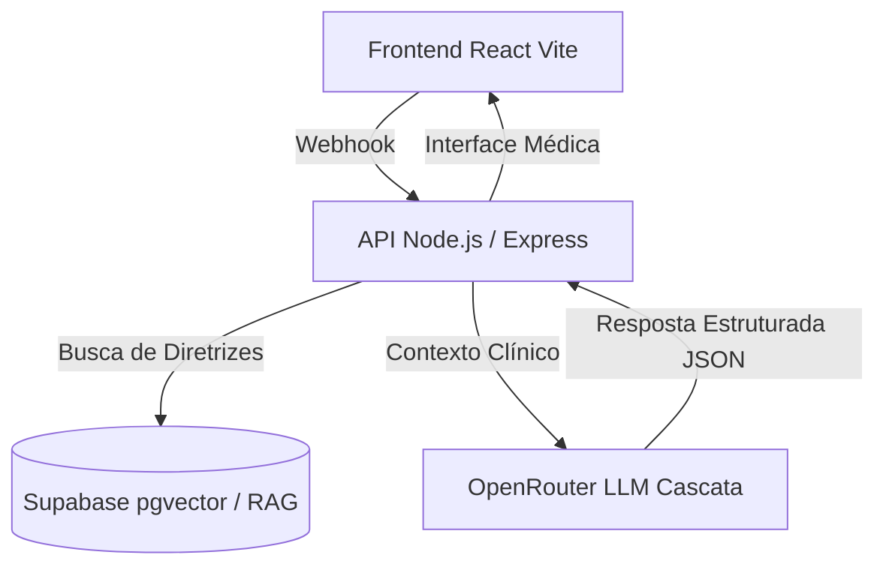

# Sistema de Apoio à Regulação Clínica (SUS-DF / SISREG)

Sistema inteligente de triagem e regulação de pacientes baseado em múltiplos agentes de IA e RAG, focado na validação de encaminhamentos médicos de acordo com as Notas Técnicas oficiais da SES-DF.

> **NOVA ARQUITETURA**: O sistema não utiliza mais o n8n. Todo o fluxo foi migrado para um backend nativo (TypeScript/Node.js) integrado com Supabase (pgvector) e OpenRouter.

---
## Modelagem do Banco (supabase)

O banco de dados relacional e vetorial foi estruturado em quatro tabelas principais para garantir auditoria, persistência de estado e suporte a RAG:


- `sessoes`: Gerencia o estado atual da triagem por profissional.
    - `id` (UUID, PK): Identificador único da sessão.
    - `profissional_id` (Varchar): Identificador do profissional/médico.
    - `agente_atual` (Varchar): Especialidade ativa no momento (orquestrador, cardiologia, dermatologia, endocrinologia, duvidas_gerais).
    - `status` (Varchar): Estado da triagem (`PENDENTE`, `FINALIZADO`, `NAO_ELEGIVEL`).
    - `dados_coletados` (JSONB): Acúmulo de informações clínicas validadas.
    - `dados_pendentes` (JSONB): Faltas identificadas pelo agente.

- `mensagens`: Histórico completo de auditoria e telemetria.
    - `sessao_id` (UUID, FK): Relacionamento com a sessão.
    - `remetente` (`profissional`, `bot`, `system`).
    - `conteudo` (Text): Mensagem trocada.
    - `modelo_usado`, `tokens_prompt`, `tokens_resposta`: Telemetria de custos e uso da IA.

- `encaminhamentos`: Dados consolidados dos casos aprovados para o SISREG.

- `documentos_rag`: Base vetorial (pgvector) contendo os trechos das Notas Técnicas oficiais do SUS.

## Documentação Completa

Toda a documentação técnica, de arquitetura e histórico de versões (n8n) foi movida para o nosso novo portal VitePress:

**[Acesse o Portal de Documentação Oficial](https://nanashii76.github.io/PETSAUDE-chatbot/)**

Para rodar a documentação localmente:
```bash
cd docs-site
npm install
npm run docs:dev
```

---

## Arquitetura Resumida



- **Frontend**: React + Vite (Interface de Chat SPA)
- **Backend**: Node.js, Express, TypeScript (Roteador de agentes e integrador Langchain/Supabase). Hospedado no **Render**.
- **Vector Database**: PostgreSQL com `pgvector` gerenciado pelo **Supabase**.
- **Modelos de IA**: OpenRouter (Cascata de modelos gratuitos como Llama 3 e Qwen).

## Estrutura de Pastas

```plaintext
PETSAUDE-chatbot/
├── backend/          
│   # API REST (Node.js/TypeScript). Contém o Orquestrador que roteia a conversa para 
│   # múltiplos agentes de IA e o serviço RAG (Langchain) integrado ao pgvector (Supabase).
├── frontend/         
│   # Interface do Chat (Single Page Application) construída em React e Vite.
│   # Renderiza mensagens médicas em Markdown e interage com o backend local/remoto via Webhook.
└── docs-site/        
    # Portal de documentação oficial gerado estaticamente com VitePress.
    # Preserva o histórico do projeto e os fluxos antigos do n8n (em docs/legado-n8n).
```

## Configuração Rápida

### Backend
Requer as variáveis `.env`:
`PORT`, `DATABASE_URL`, `OPENROUTER_API_KEY`, `SUPABASE_URL`, `SUPABASE_ANON_KEY`, `OPENAI_API_KEY`.

```bash
cd backend
npm install
npm run build
npm start
```

### Frontend
```bash
cd frontend
npm install
npm run dev
```