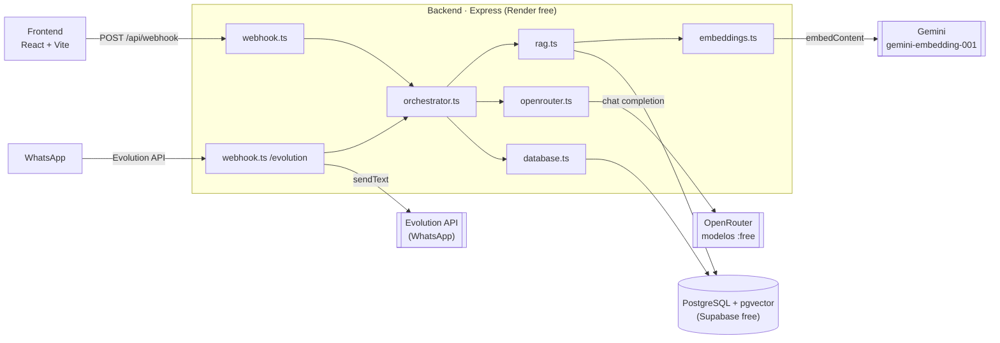
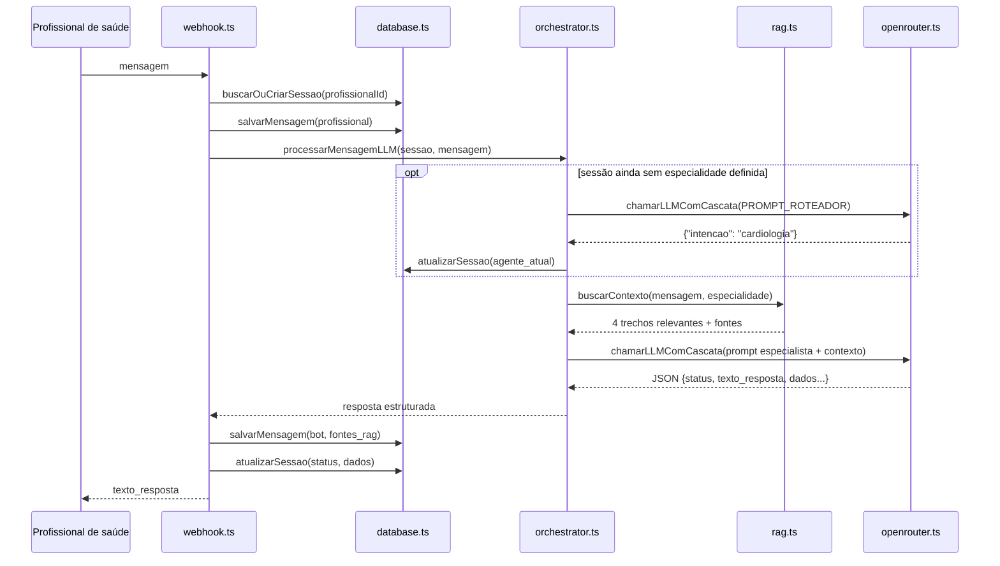

# Arquitetura do Sistema

O PETSAÚDE é um assistente conversacional que apoia profissionais de saúde do SUS-DF a montar
encaminhamentos ambulatoriais para Cardiologia, Dermatologia e Endocrinologia — validando cada
caso contra as Notas Técnicas oficiais da SES-DF antes de liberar o registro no SISREG.

O profissional descreve o caso em linguagem natural (pelo chat web ou pelo WhatsApp), e um agente
de IA especializado por área conduz uma conversa curta, pergunta os dados que faltam, valida o
quadro clínico e classifica o caso em um de três estados:

- **`PENDENTE`** — ainda faltam dados obrigatórios (o bot pergunta o que falta);
- **`FINALIZADO`** — o caso é elegível, o encaminhamento pode ser registrado;
- **`NAO_ELEGIVEL`** — o caso deve ser manejado na Atenção Primária, não na secundária.

O projeto migrou de um protótipo em n8n (veja [Histórico Legado](/legado-n8n/index)) para um
backend nativo em TypeScript, e trocou a técnica original de "injeção direta da Nota Técnica
inteira no prompt" por um [RAG vetorial de verdade](/rag).

## Visão geral da arquitetura

Dois canais de entrada (chat web e WhatsApp) convergem no mesmo backend Express, que orquestra
três dependências externas — todas no tier gratuito: o LLM de conversação ([OpenRouter](/modelos-ia)),
o modelo de embeddings ([Gemini](/rag)) e o banco vetorial (Postgres/pgvector no Supabase).



Cada seta para fora do backend é uma dependência de rede gratuita — e, como o
[histórico de incidentes](/incidentes) mostra, cada uma delas já quebrou o sistema ao menos uma vez.

## Stack tecnológica

| Camada | Tecnologia | Observação |
|---|---|---|
| Backend | Node.js + TypeScript 7 (ESM, `NodeNext`) | TS 7 usa o novo compilador nativo (Go); exige o pacote de binário da plataforma |
| Servidor HTTP | Express 5 | Sem middleware de autenticação/rate-limit nas rotas hoje |
| Acesso a dados | `pg` (driver cru) | Sem ORM — SQL parametrizado direto, pool único em `database.ts` |
| Banco | PostgreSQL + `pgvector` (Supabase) | Índice HNSW, distância de cosseno |
| LLM de conversação | OpenRouter, cascata de 4 modelos `:free` | Ver [Modelos de IA](/modelos-ia) |
| Embeddings | Gemini `gemini-embedding-001` (768d) | Chamado via `fetch` puro, sem SDK |
| WhatsApp | Evolution API (self-hosted) | Webhook `messages.upsert` + envio assíncrono |
| Frontend | React 19 + Vite 7 + `react-markdown` | SPA de página única, sem roteamento |
| Testes | Vitest 5 | 27 testes, mockando toda chamada de rede/DB |
| Deploy | Render (backend, free) + GitHub Pages (docs) | Sem Docker, sem CI de código |

## Estrutura de diretórios

O código relevante mora todo em `backend/src/`:

```
src/
├── api/
│   └── webhook.ts          # recebe o payload do front ou da Evolution API
├── core/
│   ├── orchestrator.ts     # máquina de estados (roteador → RAG → especialista)
│   ├── prompts.ts          # system prompts dos 4 agentes
│   ├── documents.ts        # texto-fonte das 3 Notas Técnicas
│   └── chunking.ts         # divide as Notas Técnicas em chunks por condição clínica
├── services/
│   ├── openrouter.ts       # cascata de modelos de chat
│   ├── embeddings.ts       # embeddings via Gemini
│   ├── rag.ts              # busca vetorial (match_documentos)
│   ├── database.ts         # sessões, mensagens, encaminhamentos
│   └── evolution.ts        # integração WhatsApp
├── database/
│   ├── init.sql              # schema completo (setup do zero)
│   ├── migration_rag.sql     # migração do schema fragmentado antigo
│   └── functions_match.sql   # função match_documentos
├── scripts/
│   └── ingestDocumentosRag.ts  # popula a base vetorial (manual)
└── tests/
    ├── core/       # chunking, orchestrator
    └── services/   # evolution, openrouter, rag
```

## Fluxo de uma mensagem

Os dois canais (chat web via `POST /api/webhook`, WhatsApp via `POST /api/webhook/evolution`)
convergem na mesma função interna, `processarEAuditar`, que trata sessão, auditoria e chamada de
IA de forma idêntica — só a forma de devolver a resposta muda (corpo HTTP vs. chamada de volta à
Evolution API).



O roteador só é chamado quando a sessão ainda não tem especialidade — a partir daí, todo turno vai
direto ao especialista.

::: warning Sessões e reaproveitamento
Uma sessão só é reaproveitada enquanto `status = 'PENDENTE'`. Assim que um caso fecha
(`FINALIZADO` ou `NAO_ELEGIVEL`), a próxima mensagem do mesmo profissional cria uma sessão nova
automaticamente e passa pelo roteador de novo.
:::

## O orquestrador

`core/orchestrator.ts` é o coração do sistema — uma máquina de estados simples, sem framework,
dividida em 5 passos dentro de `processarMensagemLLM`:

1. **Roteamento de intenção** — se `agente_atual` da sessão for `orquestrador` ou vazio, chama o
   LLM com `PROMPT_ROTEADOR`, que classifica a mensagem em `cardiologia`, `dermatologia`,
   `endocrinologia` ou `duvidas_gerais` — e nada mais. Esse agente não conversa com o usuário, só
   devolve `{"intencao": "..."}`.
2. **Montagem do histórico** — busca as mensagens anteriores da sessão (`buscarHistoricoSessao`) e
   as formata como histórico de chat (`role: 'user' | 'assistant'`).
3. **Seleção do especialista** — um `switch` simples troca o system prompt (`PROMPT_CARDIOLOGIA`,
   `PROMPT_DERMATOLOGIA`, `PROMPT_ENDOCRINOLOGIA` ou `PROMPT_GERAL`). Cada prompt segue o mesmo
   template: papel, siglas oficiais, regras de diálogo ("uma pergunta por vez"), regra de
   elegibilidade clínica e o contrato de saída em JSON.
4. **Injeção do contexto (RAG)** — chama `buscarContexto` (veja [RAG vetorial](/rag)) e anexa só os
   trechos relevantes da Nota Técnica ao system prompt, sob o cabeçalho
   `[CONTEXTO CLÍNICO OFICIAL - NOTAS TÉCNICAS DA SES-DF]`.
5. **Parse rigoroso do JSON de saída** — o especialista deve responder em JSON estrito com
   `status`, `texto_resposta`, `dados_coletados_ate_o_momento` e `dados_pendentes`. Se o
   `JSON.parse` falhar — o que já aconteceu de verdade, veja [Histórico de Incidentes](/incidentes)
   — cai num fallback amigável em vez de propagar o erro: *"Houve uma falha na estruturação
   clínica. Poderia repetir a última informação, por favor?"*, mantendo `status: PENDENTE` e
   preservando os dados já coletados.
