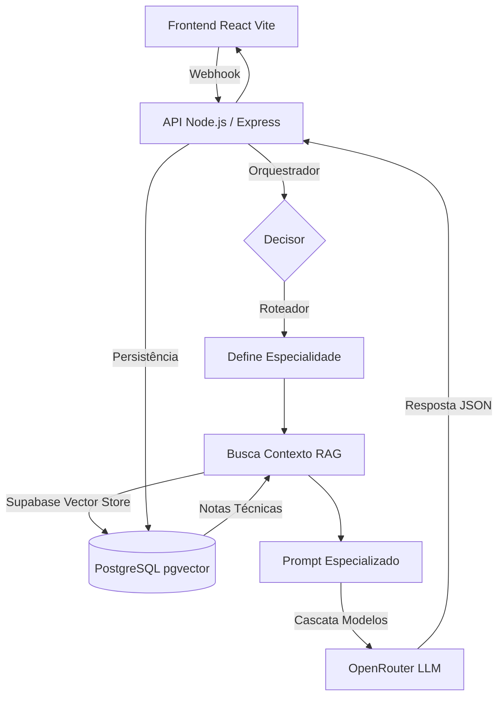

# Arquitetura do Sistema

O projeto adota uma arquitetura moderna e desacoplada, abandonando os fluxos legados (n8n) em favor de uma integração direta no código.

## Visão Geral

## Componentes

### 1. Frontend (Interface de Chat)
Desenvolvido em **React + Vite**, consome a API através de `fetch`. Renderiza as respostas médicas usando Markdown avançado. Mantém estado otimista e persistência local da sessão.

### 2. Backend (API & Orquestrador)
Escrito em **TypeScript / Node.js (Express)**. Gerencia a lógica de roteamento entre os agentes e persiste tudo no Supabase usando o cliente `pg`.
- Hospedado no **Render**.
- **Máquina de estados**: Controla se a triagem está *Pendente*, *Finalizada* ou *Não Elegível*.

### 3. Banco de Dados / Vetorial
Utiliza o **Supabase (PostgreSQL + pgvector)**:
- `sessoes`: Estado de cada triagem.
- `mensagens`: Histórico e telemetria (custo em tokens).
- `documentos_rag`: Base de conhecimento vetorial com as Notas Técnicas.

### 4. Inteligência Artificial
Integrado com a API do **OpenRouter**:
- Utiliza uma cascata defensiva: tenta o modelo mais adequado (ex: `nemotron-3`, `qwen`, `llama-3.3`), realizando fallback automático se algum falhar ou demorar.
- Exige saída em JSON estrito (`response_format: { type: "json_object" }`).
