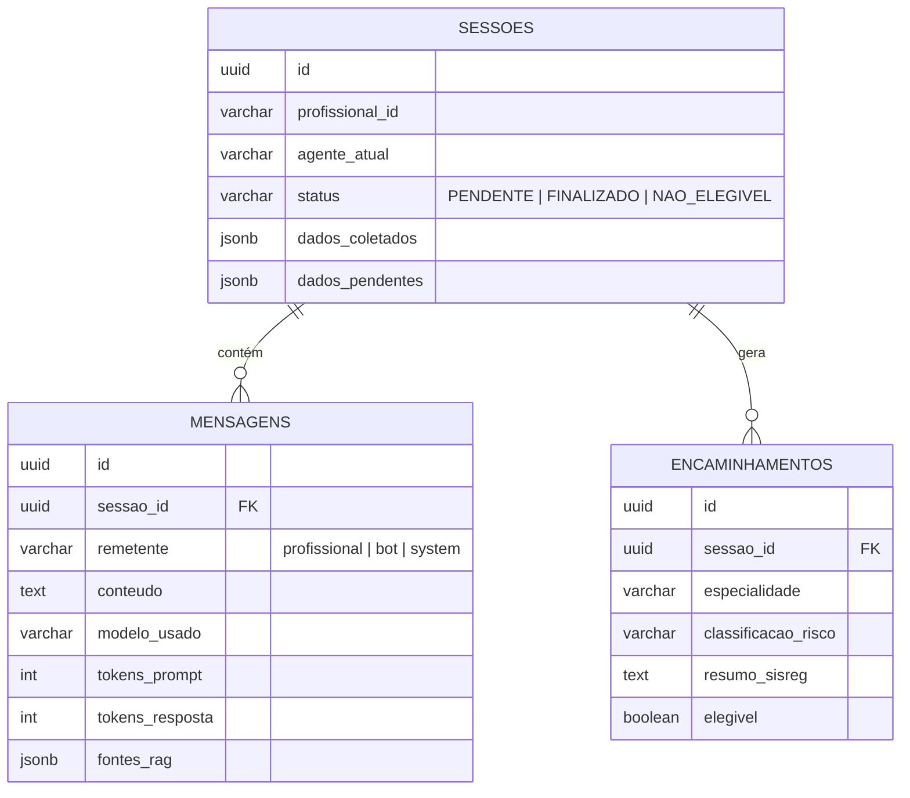

# Banco de Dados

PostgreSQL no Supabase, acessado via `pg.Pool` direto (sem ORM) em `backend/src/services/database.ts`.
Quatro tabelas, definidas em `backend/src/database/init.sql`:

`documentos_rag` (`especialidade`, `titulo`, `conteudo`, `embedding vector(768)`) é uma base de
conhecimento independente — não referencia sessão nenhuma. Veja [RAG vetorial](/rag).

## Tabelas

- **`sessoes`** — estado da triagem em andamento: qual agente/especialidade está atendendo, os
  dados já coletados e os pendentes. Só existe uma sessão `PENDENTE` por profissional por vez;
  quando o caso fecha (`FINALIZADO`/`NAO_ELEGIVEL`), a próxima mensagem cria uma sessão nova.
- **`mensagens`** — histórico completo da conversa, com telemetria (modelo usado, tokens de prompt
  e de resposta) e a coluna `fontes_rag`, que guarda quais trechos da Nota Técnica embasaram cada
  resposta do bot.
- **`encaminhamentos`** — o produto final: o registro estruturado do encaminhamento, pronto para
  ser usado no SISREG.
- **`documentos_rag`** — a base vetorial das Notas Técnicas, populada pelo script de ingestão (veja
  [RAG vetorial](/rag)).

## Índices

- Índice **HNSW** (`vector_cosine_ops`) em `documentos_rag.embedding` para busca vetorial rápida.
- Índices **GIN** em colunas JSONB (`dados_coletados`, `dados_estruturados`) para consultas dentro
  do JSON.
- Índices B-Tree comuns em chaves estrangeiras e em `sessoes.status`/`sessoes.profissional_id`.
