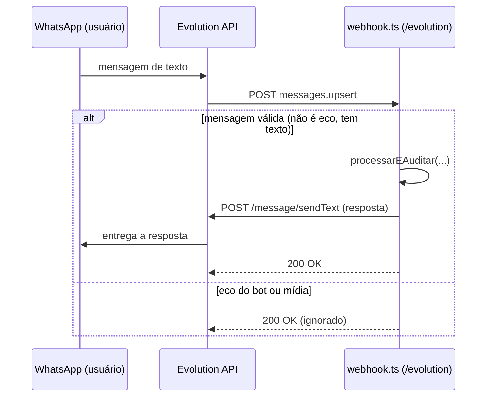

# Integrações (WhatsApp e Frontend)

## WhatsApp (Evolution API)

Via [Evolution API](https://github.com/EvolutionAPI/evolution-api) (self-hosted).
`backend/src/services/evolution.ts` tem duas responsabilidades:

- **`extrairMensagemDoWebhookEvolution`** — faz o parse do evento `messages.upsert`, descarta eco
  do próprio bot (`fromMe: true`) e mensagens sem texto (mídia, figurinha).
- **`enviarMensagemWhatsapp`** — `POST /message/sendText/{instância}` para responder de volta.

A rota `/api/webhook/evolution` sempre responde `200`, mesmo em erro — a resposta de verdade vai
por uma chamada separada à Evolution API, não no corpo HTTP do webhook, e um `200` em erro evita
que a Evolution reenvie o mesmo evento em loop.

## Frontend

SPA React 19 + Vite, componente único de chat. Gera um `chat_user_id` persistido em
`localStorage` na primeira visita, e conversa com o backend por um único contrato:

| Direção | Payload |
|---|---|
| Frontend → Backend | `{ remetente_id, mensagem, origem }` |
| Backend → Frontend | `{ success, reply }` |

Respostas renderizadas com `react-markdown`. Sem roteamento, sem gerenciamento de estado global — a
complexidade toda mora no backend.
