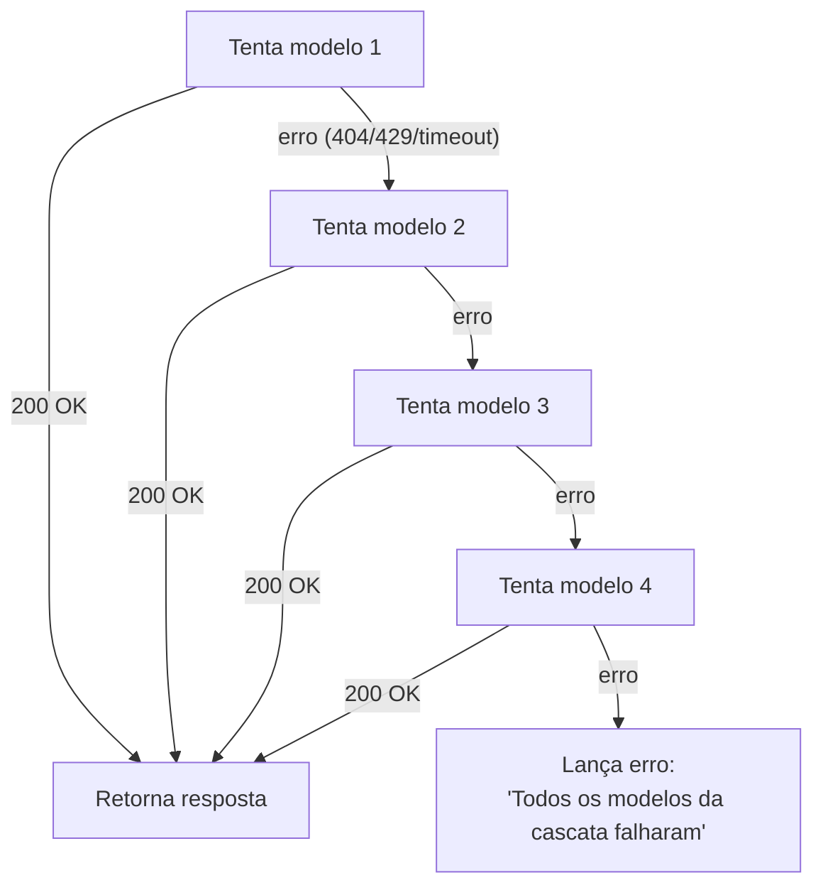

# Modelos de IA (Cascata de LLMs)

Toda chamada ao LLM de conversação passa por `chamarLLMComCascata`
(`backend/src/services/openrouter.ts`), que tenta uma lista de modelos gratuitos em ordem até um
responder com sucesso — resiliência a rate limit e indisponibilidade sem custo.

```ts
const FALLBACK_CASCADE = [
  'google/gemma-4-26b-a4b-it:free',         // Rápido e limpo
  'nex-agi/nex-n2.5-mini:free',             // Contexto longo (262k tokens)
  'nvidia/nemotron-3-super-120b-a12b:free', // Ótimo raciocínio lógico
  'liquid/lfm-2.5-2.6b:free'                // Rede de segurança final
];
```

Cada chamada usa `response_format: { type: 'json_object' }` e `temperature: 0.2` para respostas
clínicas determinísticas. Isso não é cosmético — veja no
[Histórico de Incidentes](/incidentes#5-cascata-de-modelos-e-resposta-nao-json) como um modelo que
ignora esse parâmetro derrubou o parse de JSON em produção.

## Como a cascata funciona



Se qualquer modelo responder com sucesso, a cascata para ali — os modelos seguintes nunca são
chamados. Isso é coberto por testes automatizados em
[`services/openrouter.test.ts`](https://github.com/Nanashii76/PETSAUDE-chatbot/blob/feat-testing-rag/backend/src/tests/services/openrouter.test.ts).

::: warning O catálogo de modelos gratuitos muda com frequência
O catálogo de modelos `:free` do OpenRouter muda com frequência, sem aviso — 3 dos 4 modelos
originais desta cascata já deixaram de existir uma vez (ver
[Histórico de Incidentes](/incidentes)). Antes de trocar algum ID aqui, confira
`GET https://openrouter.ai/api/v1/models` e filtre por `supported_parameters` contendo
`response_format` — nem todo modelo gratuito respeita esse contrato.
:::

## Embeddings

O modelo de embeddings é uma peça separada e desacoplada desta cascata — veja
[RAG vetorial](/rag) para os detalhes de `gemini-embedding-001`.
