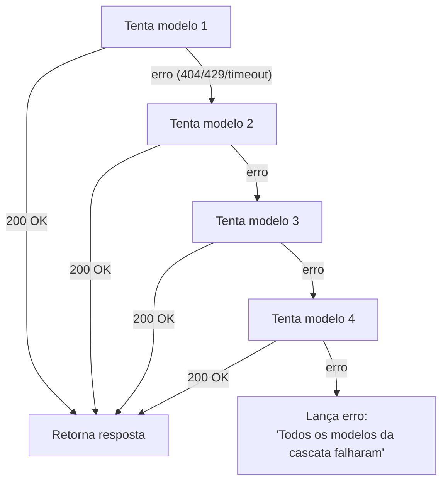

# Modelos de IA (Cascata de LLMs)

Toda chamada ao LLM de conversação passa por `chamarLLMComCascata`
(`backend/src/services/openrouter.ts`), que tenta uma lista de modelos gratuitos em ordem até um
responder com sucesso — resiliência a rate limit e indisponibilidade sem custo.

```ts
// Ordenados por velocidade medida com o prompt clínico real, não só por confiabilidade.
const FALLBACK_CASCADE = [
  'google/gemma-4-26b-a4b-it:free',          // Rápido quando disponível, mas o mais rate-limited (429)
  'nvidia/nemotron-3-super-120b-a12b:free',  // ~4-15s quando o provedor não está sobrecarregado — o único que respeita reasoning baixo
  'dots-studio/dots-3-note-preview:free',    // Provider diferente (AtlasCloud), confiável, porém lento (15-28s)
  'liquid/lfm-2.5-2.6b:free'                 // Rede de segurança final — também lento (15-18s), reasoning sempre obrigatório
];
```

Cada chamada usa `response_format: { type: 'json_object' }` e `temperature: 0.2` para respostas
clínicas determinísticas. Isso não é cosmético — veja no
[Histórico de Incidentes](/incidentes#5-cascata-de-modelos-e-resposta-nao-json) como um modelo que
ignora esse parâmetro derrubou o parse de JSON em produção.

Também manda `reasoning: { max_tokens: 100 }` e usa `AbortController` com timeout de 30s por
tentativa. Todo modelo `:free` atual do catálogo suporta "thinking"/reasoning — sem limitar isso,
um modelo pode gastar o `max_tokens` inteiro narrando o próprio raciocínio em texto livre e nunca
chegar a emitir o JSON (`finish_reason: "length"`, parse quebra). É um teto numérico
(`max_tokens: 100`), não `enabled: false` nem `effort: 'low'`: testado ao vivo,
`liquid/lfm-2.5-2.6b:free` rejeita reasoning totalmente desligado com erro 400 ("Reasoning is
mandatory for this endpoint"), e `effort: 'low'` ainda deixava passar 1000+ tokens de raciocínio em
tarefas complexas — o teto numérico é aceito por todos os 4 modelos, mesmo que dois deles
(`dots-studio`, `liquid`) não o respeitem à risca. O timeout de 30s é rede de segurança contra
travamento, não otimização de velocidade: é maior que a faixa observada de 15-28s desses dois
modelos de propósito, para não converter uma resposta lenta-mas-correta numa falha rápida. Ver
[Histórico de Incidentes](/incidentes#6-modelo-de-raciocinio-estourando-max-tokens-antes-do-json) e
[#7](/incidentes#7-latencia-inerente-aos-modelos-gratuitos-de-raciocinio).

## Como a cascata funciona


```mermaid
flowchart TD
  A["Tenta modelo 1"] -->|"200 OK"| S["Retorna resposta"]
  A -->|"erro (404/429/timeout)"| B["Tenta modelo 2"]
  B -->|"200 OK"| S
  B -->|"erro"| C["Tenta modelo 3"]
  C -->|"200 OK"| S
  C -->|"erro"| D["Tenta modelo 4"]
  D -->|"200 OK"| S
  D -->|"erro"| E["Lança erro:<br/>'Todos os modelos da cascata falharam'"]
```

Se qualquer modelo responder com sucesso, a cascata para ali — os modelos seguintes nunca são
chamados. Isso é coberto por testes automatizados em
[`services/openrouter.test.ts`](https://github.com/Nanashii76/PETSAUDE-chatbot/blob/feat-testing-rag/backend/src/tests/services/openrouter.test.ts).

::: warning O catálogo de modelos gratuitos muda com frequência
O catálogo de modelos `:free` do OpenRouter muda com frequência, sem aviso — 3 dos 4 modelos
originais desta cascata já deixaram de existir uma vez (ver
[Histórico de Incidentes](/incidentes)). Antes de trocar algum ID aqui, confira
`GET https://openrouter.ai/api/v1/models` e filtre por `supported_parameters` contendo
`response_format` — nem todo modelo gratuito respeita esse contrato.
:::

## Embeddings

O modelo de embeddings é uma peça separada e desacoplada desta cascata — veja
[RAG vetorial](/rag) para os detalhes de `gemini-embedding-001`.
