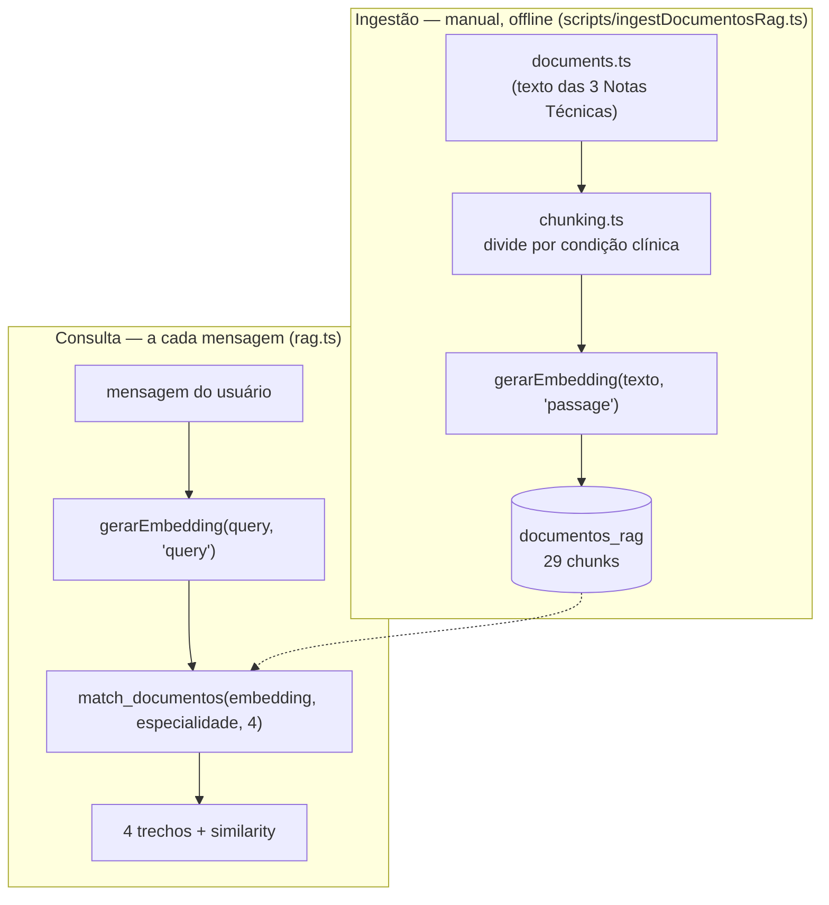

# Recuperação de Conhecimento (RAG)

::: danger Esta página foi reescrita
A versão anterior desta página descrevia um design que **já não existe** (busca via LangChain
`SupabaseVectorStore` + embeddings da OpenAI). Esse fluxo foi abandonado nesta branch em favor do
que está descrito abaixo — sem LangChain, sem OpenAI, embeddings gerados pelo Gemini.
:::

Em vez de injetar a Nota Técnica inteira (centenas de linhas) em todo turno da conversa — o design
original, abandonado por estourar o orçamento de contexto do modelo e causar respostas cortadas —
o sistema recupera só os **4 trechos mais relevantes** para a pergunta atual. A ingestão (offline)
e a consulta (a cada mensagem) são fases completamente separadas.



Ingestão e consulta usam a mesma função de embedding, mas nunca rodam no mesmo caminho de execução.

## Ingestão

O script `backend/src/scripts/ingestDocumentosRag.ts`:

1. Lê o texto bruto das 3 Notas Técnicas de `core/documents.ts`.
2. Divide cada documento em **chunks** — um por condição clínica — usando `core/chunking.ts`. O
   regex reconhece 3 convenções de cabeçalho diferentes usadas nos documentos-fonte
   (`## Consulta em Cardiologia - X`, `Consulta em Endocrinologia - X` sem numeração, e
   `N. Consulta em Dermatologia - X` — às vezes sem repetir "Consulta em", como em `6. Micoses`).
   Resultado: **8 chunks de cardiologia, 10 de dermatologia, 11 de endocrinologia** (29 no total).
3. Gera o embedding de cada chunk com `gerarEmbedding(texto, 'passage')`.
4. Insere `{especialidade, titulo, conteudo, embedding}` na tabela `documentos_rag`.

O script começa com `TRUNCATE TABLE documentos_rag`, então é seguro rodar de novo sempre que o
texto das Notas Técnicas mudar:

```bash
npx tsx src/scripts/ingestDocumentosRag.ts
```

## Consulta

Dentro de `services/rag.ts`, a função `buscarContexto(query, agenteAtual, limite = 4)`:

1. Se `agenteAtual` não for uma das 3 especialidades (ex: `duvidas_gerais`), retorna vazio
   imediatamente, sem chamar nenhuma API.
2. Gera o embedding da mensagem do usuário com `gerarEmbedding(query, 'query')` — mesmo modelo do
   Gemini, mas com `taskType: RETRIEVAL_QUERY` em vez de `RETRIEVAL_DOCUMENT`.
3. Chama a função SQL `match_documentos(embedding, especialidade, 4)`, que filtra por
   `especialidade` e ordena pelos chunks mais próximos por distância de cosseno.
4. Concatena o conteúdo dos 4 chunks recuperados, e retorna também a lista de fontes
   (`{titulo, similarity}`).

```sql
CREATE OR REPLACE FUNCTION match_documentos(
  query_embedding vector(768),
  especialidade_filtro varchar(50),
  match_count int DEFAULT 4
) RETURNS TABLE (titulo text, conteudo text, similarity float)
LANGUAGE plpgsql AS $$
BEGIN
  RETURN QUERY
  SELECT d.titulo, d.conteudo, 1 - (d.embedding <=> query_embedding) AS similarity
  FROM documentos_rag d
  WHERE d.especialidade = especialidade_filtro
  ORDER BY d.embedding <=> query_embedding
  LIMIT match_count;
END;
$$;
```

## Rastreabilidade

Cada resposta salva, na coluna `fontes_rag` da tabela `mensagens`, quais trechos (título +
similaridade de cosseno) embasaram aquela resposta específica — dá para auditar depois qual parte
da Nota Técnica o bot usou para decidir `FINALIZADO` ou `NAO_ELEGIVEL` num caso real.

## Por que não é LangChain

Não há `SupabaseVectorStore` nem SDK de terceiros no caminho de consulta — só duas chamadas HTTP
simples (Gemini para o vetor, Postgres para a busca por similaridade via `pool.query`, o mesmo
driver `pg` usado no resto do backend). Isso mantém a peça de embedding **desacoplada** de qual LLM
gera a resposta final: trocar o provedor de chat (veja [Modelos de IA](/modelos-ia)) nunca exige
tocar no RAG, e vice-versa.

::: tip Por que Gemini e não um modelo local?
Um modelo de embedding local (`@xenova/transformers`, sem nenhuma API externa) foi avaliado e
descartado: mediu-se ~732MB de RSS só para carregar o modelo quantizado, acima do limite de 512MB
do Render free. Ver [Infraestrutura](/infraestrutura).
:::
